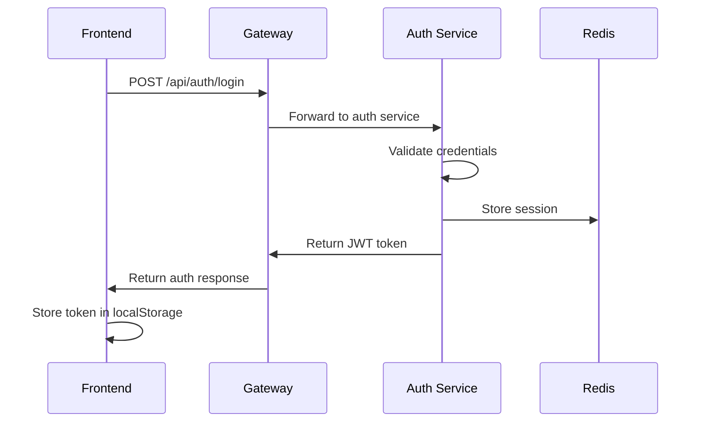
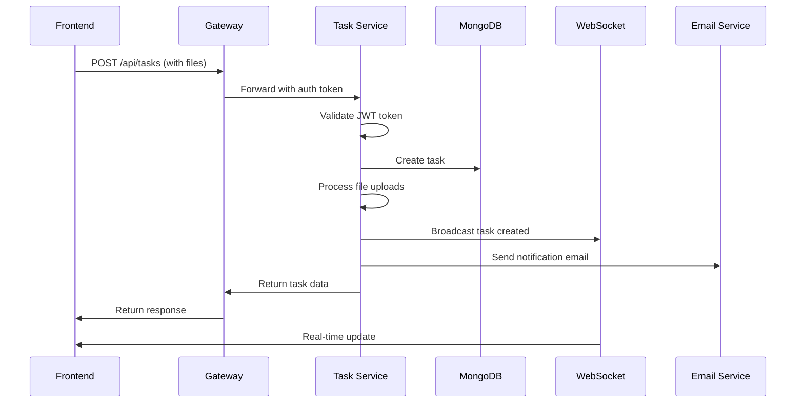
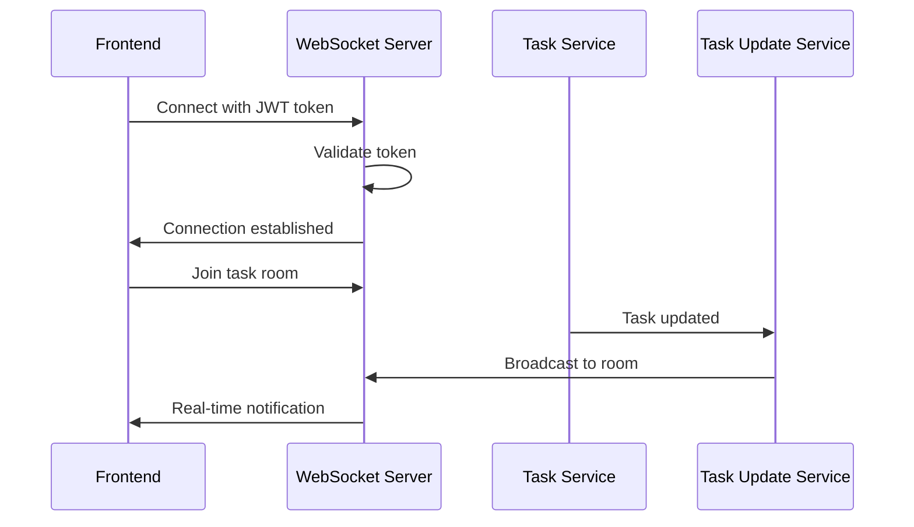
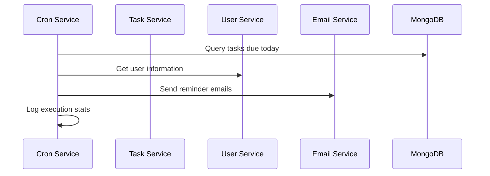

# IndiaNIC Task Management System - API Flow Documentation

## 🏗️ System Architecture Overview

The IndiaNIC Task Management System is built using a microservices architecture with the following components:

```
┌─────────────────┐    ┌─────────────────┐    ┌─────────────────┐
│   Frontend      │    │   API Gateway   │    │   Auth Service  │
│   (React)       │◄──►│   (Express)     │◄──►│   (Express)     │
│                 │    │                 │    │                 │
│ - Task Manager  │    │ - Route Proxy   │    │ - JWT Auth      │
│ - Real-time UI  │    │ - File Upload   │    │ - User Mgmt     │
│ - WebSocket     │    │ - CORS          │    │ - Redis Cache   │
└─────────────────┘    └─────────────────┘    └─────────────────┘
                                │
                                ▼
                       ┌─────────────────┐
                       │  Task Service   │
                       │   (Express)     │
                       │                 │
                       │ - CRUD Tasks    │
                       │ - File Storage  │
                       │ - Cron Jobs     │
                       │ - WebSocket     │
                       │ - Email Service │
                       └─────────────────┘
```

## 🔄 API Flow Patterns

### 1. Authentication Flow



**Authentication Endpoints:**
- `POST /api/auth/register` - User registration
- `POST /api/auth/login` - User login
- `GET /api/auth/me` - Get current user profile
- `PUT /api/auth/profile` - Update user profile
- `POST /api/auth/profile/avatar` - Upload avatar
- `PUT /api/auth/profile/password` - Change password
- `POST /api/auth/logout` - Logout current session
- `POST /api/auth/logout-all` - Logout all sessions

### 2. Task Management Flow



**Task Management Endpoints:**
- `GET /api/tasks` - Get all tasks for user
- `POST /api/tasks` - Create new task with files
- `GET /api/tasks/:id` - Get specific task
- `PUT /api/tasks/:id` - Update task with files
- `DELETE /api/tasks/:id` - Delete task
- `GET /api/tasks/export/csv` - Export tasks to CSV

### 3. Real-time Updates Flow



**WebSocket Events:**
- `task:created` - New task created
- `task:updated` - Task updated
- `task:deleted` - Task deleted
- `task:status_changed` - Task status changed

### 4. Cron Job Flow



**Cron Job Endpoints:**
- `GET /api/tasks/cron/stats` - Get cron statistics
- `POST /api/tasks/cron/trigger` - Manually trigger cron
- `GET /api/tasks/cron/reminders/today` - Get today's reminders
- `GET /api/tasks/cron/health` - Get cron health status
- `POST /api/tasks/cron/start` - Start cron scheduler
- `POST /api/tasks/cron/stop` - Stop cron scheduler

## 🔐 Security Flow

### JWT Authentication Flow

1. **Login Process:**
   ```
   User Login → Validate Credentials → Generate JWT → Store in Redis → Return Token
   ```

2. **Protected Route Access:**
   ```
   Request → Extract JWT → Validate Token → Check Redis Session → Allow/Deny
   ```

3. **Token Validation:**
   - JWT signature verification
   - Token expiration check
   - Redis session validation
   - User permission verification

### File Upload Security

1. **File Validation:**
   - File type validation (PDF, DOCX, JPG)
   - File size limits (10MB max)
   - Malware scanning (optional)

2. **Storage Security:**
   - Secure file paths
   - User-specific directories
   - Access control validation

## 📊 Data Flow Patterns

### 1. Task Creation Flow

```javascript
// Frontend Request
const formData = new FormData();
formData.append('title', 'New Task');
formData.append('description', 'Task description');
formData.append('dueDate', '2024-01-15');
formData.append('files', file1);
formData.append('files', file2);

// Gateway Processing
- Validate JWT token
- Forward multipart data
- Handle file uploads

// Task Service Processing
- Validate user permissions
- Create task in MongoDB
- Process and store files
- Send email notification
- Broadcast real-time update
```

### 2. Real-time Update Flow

```javascript
// WebSocket Connection
const socket = io('http://localhost:5050', {
  auth: { token: jwtToken }
});

// Join task room
socket.emit('join-task', { taskId: 'task123' });

// Listen for updates
socket.on('task:updated', (data) => {
  updateTaskInUI(data);
  showNotification('Task updated');
});
```

### 3. Cron Job Execution Flow

```javascript
// Daily at 8 AM
cron.schedule('0 8 * * *', async () => {
  // 1. Get all tasks due today
  const tasksDueToday = await Task.find({
    dueDate: { $gte: startOfDay, $lte: endOfDay },
    status: { $ne: 'Completed' }
  });

  // 2. Group by user
  const tasksByUser = groupBy(tasksDueToday, 'user');

  // 3. Send reminder emails
  for (const [userId, tasks] of Object.entries(tasksByUser)) {
    const user = await getUserById(userId);
    await sendReminderEmail(user.email, user.name, tasks);
  }
});
```

## 🔧 Error Handling Flow

### 1. Authentication Errors

```javascript
// 401 Unauthorized
{
  "message": "Invalid credentials",
  "error": "User not found or password incorrect"
}

// 403 Forbidden
{
  "message": "Access denied",
  "error": "Insufficient permissions"
}
```

### 2. Validation Errors

```javascript
// 400 Bad Request
{
  "message": "Validation failed",
  "errors": [
    {
      "field": "title",
      "message": "Title is required"
    },
    {
      "field": "files",
      "message": "Invalid file type"
    }
  ]
}
```

### 3. File Upload Errors

```javascript
// 413 Payload Too Large
{
  "message": "File too large",
  "error": "Maximum file size is 10MB"
}

// 415 Unsupported Media Type
{
  "message": "Invalid file type",
  "error": "Only PDF, DOCX, JPG files are allowed"
}
```

## 📈 Monitoring and Health Checks

### 1. Service Health Endpoints

```javascript
// Gateway Health
GET /health
Response: { "status": "Gateway running" }

// Auth Service Health
GET /api/auth/health
Response: { "status": "Auth service healthy" }

// Task Service Health
GET /api/tasks/health
Response: { "status": "Task service healthy" }
```

### 2. Cron Job Monitoring

```javascript
// Cron Statistics
GET /api/tasks/cron/stats
Response: {
  "isRunning": true,
  "lastRun": "2024-01-15T08:00:00Z",
  "nextRun": "2024-01-16T08:00:00Z",
  "totalRuns": 150,
  "successfulRuns": 148,
  "failedRuns": 2
}
```

### 3. WebSocket Monitoring

```javascript
// WebSocket Statistics
GET /api/tasks/socket/stats
Response: {
  "connectedClients": 25,
  "activeRooms": 10,
  "totalMessages": 1500,
  "uptime": "2 days, 5 hours"
}
```

## 🚀 Performance Optimization

### 1. Caching Strategy

```javascript
// Redis Caching
- User profiles cached for 1 hour
- Task lists cached for 5 minutes
- Session data cached until logout
```

### 2. Database Optimization

```javascript
// MongoDB Indexes
- User email (unique)
- Task user + status
- Task dueDate + status
- Task createdAt (for sorting)
```

### 3. File Upload Optimization

```javascript
// File Processing
- Image compression (Sharp)
- PDF validation
- Virus scanning (optional)
- CDN integration (production)
```

## 🔄 API Integration Examples

### 1. Frontend Integration

```javascript
// API Service
class TaskAPI {
  static async createTask(taskData, files) {
    const formData = new FormData();
    Object.keys(taskData).forEach(key => {
      formData.append(key, taskData[key]);
    });
    
    if (files) {
      files.forEach(file => {
        formData.append('files', file);
      });
    }

    const response = await fetch('/api/tasks', {
      method: 'POST',
      headers: {
        'Authorization': `Bearer ${getToken()}`
      },
      body: formData
    });

    return response.json();
  }
}
```

### 2. WebSocket Integration

```javascript
// Real-time Updates
class TaskSocket {
  constructor() {
    this.socket = io('http://localhost:5050', {
      auth: { token: getToken() }
    });
    
    this.setupListeners();
  }

  setupListeners() {
    this.socket.on('task:created', this.handleTaskCreated);
    this.socket.on('task:updated', this.handleTaskUpdated);
    this.socket.on('task:deleted', this.handleTaskDeleted);
  }

  joinTaskRoom(taskId) {
    this.socket.emit('join-task', { taskId });
  }
}
```

### 3. Cron Job Integration

```javascript
// Manual Cron Trigger
async function triggerCronJob() {
  const response = await fetch('/api/tasks/cron/trigger', {
    method: 'POST',
    headers: {
      'Authorization': `Bearer ${getToken()}`
    }
  });

  const result = await response.json();
  console.log('Cron job triggered:', result);
}
```

## 📋 API Response Standards

### 1. Success Response Format

```javascript
{
  "success": true,
  "data": {
    // Response data
  },
  "message": "Operation completed successfully"
}
```

### 2. Error Response Format

```javascript
{
  "success": false,
  "message": "Error description",
  "error": "Detailed error information",
  "code": "ERROR_CODE"
}
```

### 3. Pagination Format

```javascript
{
  "success": true,
  "data": {
    "items": [...],
    "pagination": {
      "page": 1,
      "limit": 10,
      "total": 100,
      "pages": 10
    }
  }
}
```

## 🔧 Development and Testing

### 1. Local Development Setup

```bash
# Start all services
docker-compose up -d

# Or start individually
npm run dev:auth
npm run dev:task
npm run dev:gateway
npm run dev:frontend
```

### 2. API Testing

```bash
# Test authentication
curl -X POST http://localhost:5050/api/auth/login \
  -H "Content-Type: application/json" \
  -d '{"email":"test@example.com","password":"password123"}'

# Test task creation
curl -X POST http://localhost:5050/api/tasks \
  -H "Authorization: Bearer YOUR_JWT_TOKEN" \
  -F "title=Test Task" \
  -F "description=Test Description" \
  -F "files=@test.pdf"
```

### 3. WebSocket Testing

```javascript
// Test WebSocket connection
const socket = io('http://localhost:5050', {
  auth: { token: 'YOUR_JWT_TOKEN' }
});

socket.on('connect', () => {
  console.log('Connected to WebSocket');
});

socket.emit('join-task', { taskId: 'task123' });
```

## 📚 Additional Resources

- **Swagger Documentation**: `http://localhost:5050/api-docs`
- **Health Checks**: `http://localhost:5050/health`
- **Cron Statistics**: `http://localhost:5050/api/tasks/cron/stats`
- **WebSocket Stats**: `http://localhost:5050/api/tasks/socket/stats`

This comprehensive API flow documentation provides a complete understanding of the system architecture, data flow patterns, security mechanisms, and integration examples for the IndiaNIC Task Management System. 